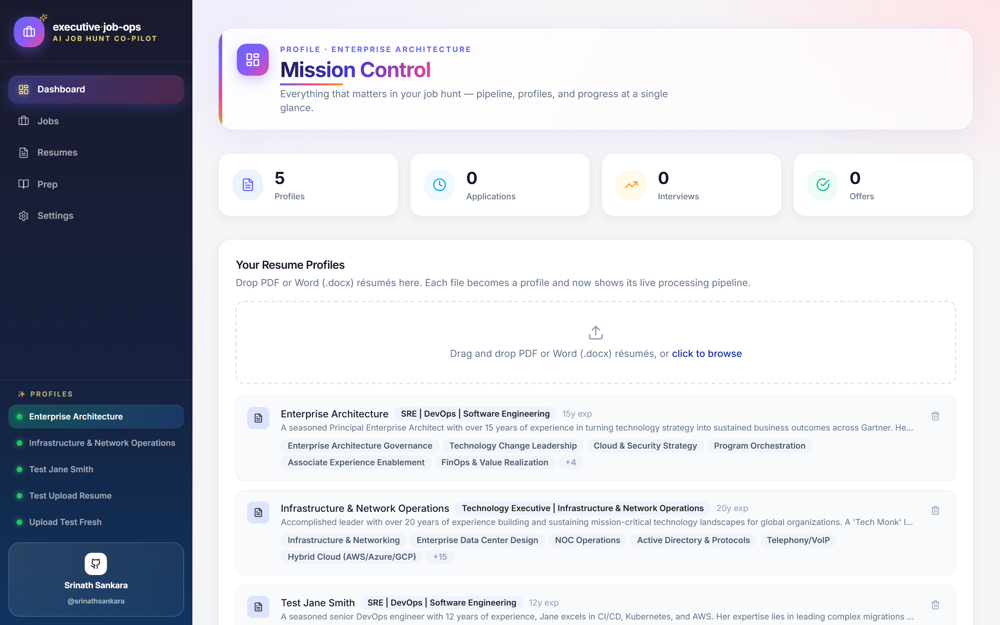
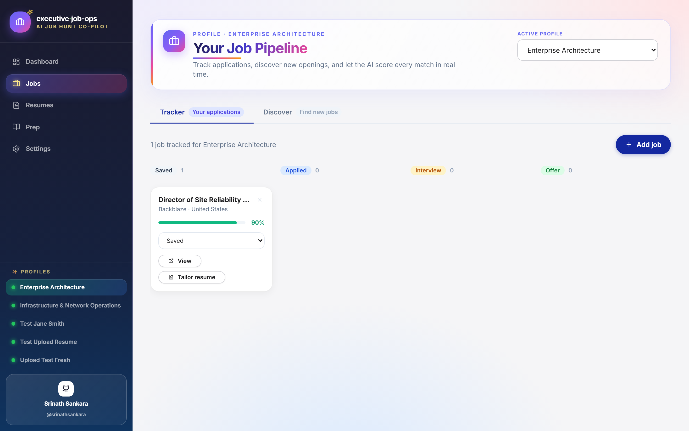
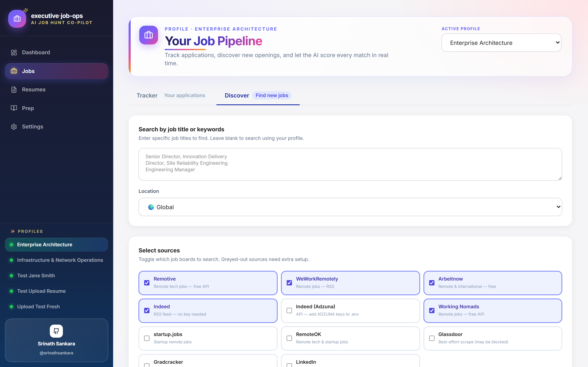
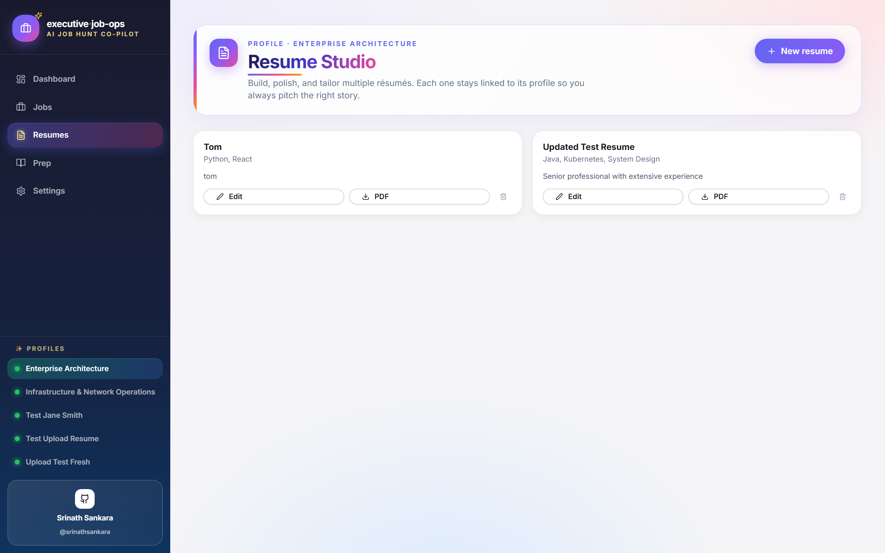
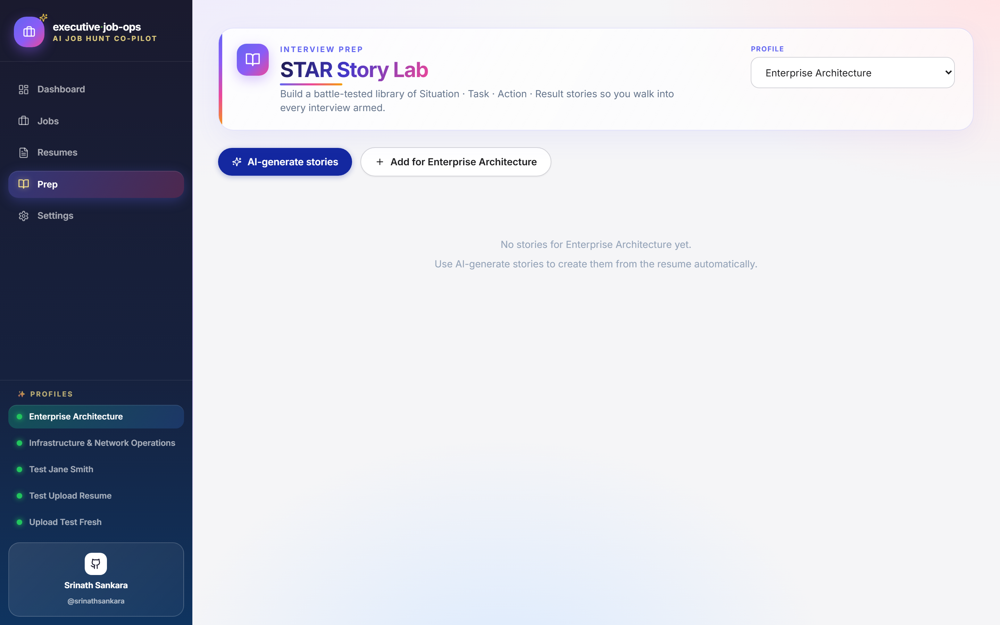
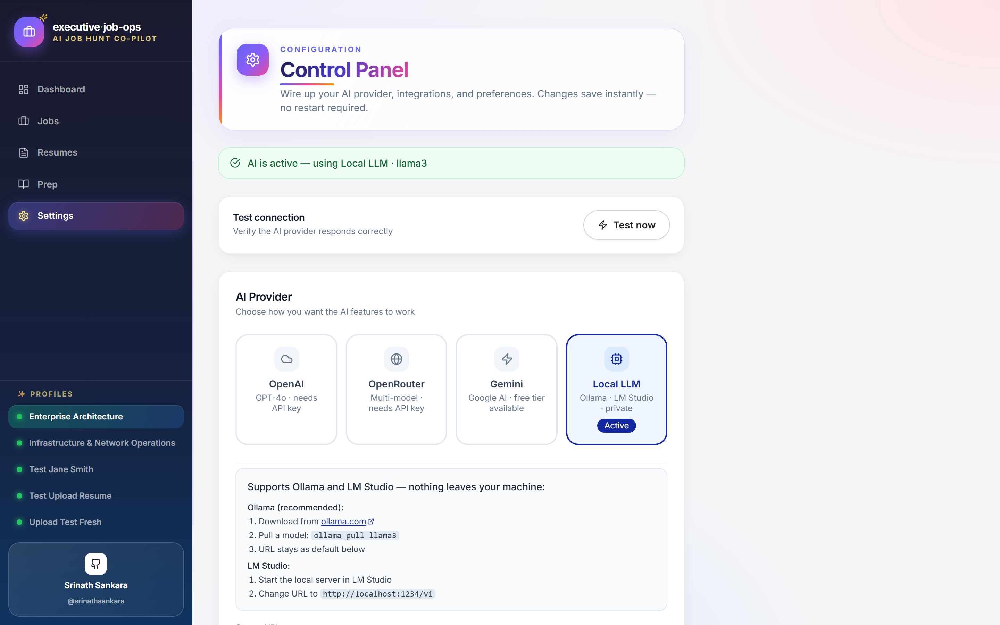

# executive-job-ops

**AI-powered job hunt assistant — by [@srinathsankara](https://github.com/srinathsankara)**

Drop a resume. Paste a job link. Get matched, tracked, and interview-ready — automatically.

No coding needed. Works on Windows, Mac, and Linux.

<p align="center">
  
</p>

<p align="center">
  <em>Your entire job hunt in one place: résumé profiles, match scoring, kanban tracker, interview prep.</em>
</p>

---

## Why this beats the usual job-hunt stack

| | The old way | **executive-job-ops** |
|---|---|---|
| **Tracking jobs** | Excel spreadsheet you forget to open | Kanban board per résumé profile |
| **Résumé tailoring** | Edit in Word, rename, lose the master | One click — AI rewrites and downloads a fresh PDF |
| **Match scoring** | Guess if you're qualified | 0–100% score + skill gap list per job |
| **Interview prep** | Google "STAR story examples" | AI builds STAR stories from *your* résumé |
| **Cover letters** | Paste into ChatGPT, re-explain the role | One button — job context already loaded |
| **Job discovery** | Check five boards in five tabs | Search 9 boards (Remotive, WWR, Arbeitnow, Indeed, LinkedIn, …) from one page |
| **Cost** | ChatGPT Plus $20/mo + spreadsheet | **$0** with Ollama, **~$1/mo** with GPT-4o-mini |
| **Privacy** | Your résumé sitting on someone else's servers | Local SQLite, Ollama stays on your laptop |
| **Setup** | None, but chaos | One double-click of `INSTALL-WINDOWS.bat` |

---

## What's new (latest)

### ✨ AI-powered job coaching (new!)
- **A–F grade chip** on every job card — scan a Kanban column and see match quality at a glance
- **6-dimensional analysis** — skills, experience level, domain relevance, leadership fit, compensation, culture signal. Each scored independently so you understand *exactly* why a role fits or doesn't
- **One-line "why" rationale** — AI explains the biggest strength and the biggest risk in a single readable sentence
- **Salary negotiation brief** — one click generates anchors, questions, concession ladders, and walk-away scripts for every job
- **Company research brief** — deep-dive on the target company: what they do, stage, recent signals, smart interview questions, red flags
- **LinkedIn outreach drafts** — three tailored messages (recruiter / hiring manager / peer) with hooks from the job posting and *your* résumé
- **Auto-accumulating STAR bank** — after analysing a job, one click generates 2 new stories tailored to *that specific role*, deduped against your existing bank, auto-tagged by company

### 🚀 Discovery & Batch Operations
- **Portal Scanner** — directly search 45+ curated company career boards: Anthropic, OpenAI, Stripe, Figma, Netflix, Palantir, Linear, Supabase across Greenhouse (35), Lever (8), Ashby (14), and Wellfound (4)
- **Custom portal queries** — override the curated list to search any companies you want on any ATS platform
- **Batch-add jobs** — paste up to 25 job URLs at once (from email, slack, browser tabs, anywhere), deduplicate, analyse in parallel, get a report of added/duplicate/failed with per-URL titles and grades
- **Coach mode** — persistent toggle with contextual tips on search strategy
- **Persistent filters** — your Discovery sources, keywords, country, and custom portals survive refresh and tab switches
- **Smart grouping** — results automatically grouped by source so you can see which platforms yielded the best matches

### 📊 Dashboard & Navigation
- **Under-applying nudge** — if you've applied to fewer than 5 jobs this week, a friendly card reminds you that volume beats resume quality
- **Topbar profile switcher** — compact dropdown in the page header instead of sidebar-only access
- **Vim-style shortcuts** — `g d` (Dashboard), `g j` (Jobs), `g r` (Resumes), `g p` (Prep), `g s` (Settings), `/` focus search, `?` shortcuts panel
- **Clickable stat cards** — Mission Control cards navigate to Jobs/Resumes when clicked

### ⚡ Performance Tuning
- **Profile skill memoisation** — build a lowercase set of profile skills once, reuse across all 60 job rows; cuts O(N×M×K) to O(N×K) for skill gap detection
- **Semaphore-bounded portal fetches** — max 10 concurrent HTTPS requests per portal scanner (Greenhouse, Lever, Ashby, Wellfound) so slow boards don't stall the entire search
- **AI client pre-warm** — AsyncOpenAI client instantiated on backend startup, so first user request doesn't pay SSL handshake + connection pool setup overhead
- **React Query staleTime: 5 min** — profiles, STAR stories, and portal catalogs cached for 5 minutes; `gcTime: 30 min` keeps them in memory; `refetchOnWindowFocus: false` avoids tab-switching re-fetches
- **Lazy localStorage** — Discovery filters only load on first render, only save after mount to avoid boot-time I/O

### 📝 Earlier features
- **Vibrant new UI** — gradient sidebar, glassmorphism cards, animated page headers and a friendly loading meme that cycles 20 different phrases while the AI is thinking.
- **Dynamic sidebar** — auto-sizes to your longest profile name (no more truncation) and the GitHub link is now centered and clearly visible.
- **Reusable page headers** — every page gets a consistent gradient header with eyebrow + icon.
- **Tailor a resume from your computer** — on any job card, click `Tailor resume` → `Upload from computer` → pick a **PDF *or* Word (.docx)** file. The AI rewrites it for the role and saves a tailored PDF.
- **Upload-based skill gap analysis** — open `Match Score Breakdown → Detailed Skill Gap Analysis` and pick either a saved profile résumé or upload a one-off **PDF / Word (.docx)** file from disk for instant keyword-level gap detection.
- **Internal resume builder** — the SQLite-backed Resume Studio replaces RxResume. Create, edit and export résumés as PDFs without spinning up a separate Docker container.
- **Local-first by default** — Ollama is preconfigured as the default LLM provider. Just `ollama pull llama3` and you're running fully offline.

---

## What it does

| Feature | How it works |
|---|---|
| **Auto resume profiles** | Drop `sre-leadership.pdf` (or `.docx`) in the resumes folder — profile created instantly, no setup |
| **Job match scoring** | Paste any job URL or description — AI scores the fit, finds skill gaps, estimates salary |
| **Application tracker** | Kanban board per profile: Saved → Applied → Interview → Offer → Rejected |
| **Resume tailoring** | Pick a saved résumé *or* upload a PDF/Word file from your computer — AI rewrites it for the job and downloads a tailored PDF |
| **Skill gap analysis** | Detailed gap report against either a stored résumé or an ad-hoc upload (PDF or .docx) |
| **Cover letter** | One click, tailored to the specific job and your résumé |
| **Interview prep** | STAR story bank + role-specific questions generated from the job description |
| **Internal Resume Studio** | Build, edit, and export PDFs from a SQLite-backed builder — no third-party services |
| **Works offline** | Ollama is the default provider — free, private, no internet needed |

---

## See it in action

<table>
<tr>
<td width="50%" valign="top">
<h3>Mission Control</h3>
<em>Every metric in one glance — profiles, applications, interviews, offers.</em><br>

</td>
<td width="50%" valign="top">
<h3>Job Pipeline</h3>
<em>Kanban board per profile. Add a URL, get match scoring, tailor a résumé.</em><br>

</td>
</tr>
<tr>
<td width="50%" valign="top">
<h3>Discovery Engine</h3>
<em>Search 9 job boards at once — Remotive, WWR, Arbeitnow, Indeed, LinkedIn, and more.</em><br>

</td>
<td width="50%" valign="top">
<h3>Resume Studio</h3>
<em>Built-in SQLite résumé builder. Edit inline, export polished PDFs — no Docker, no third-party services.</em><br>

</td>
</tr>
<tr>
<td width="50%" valign="top">
<h3>STAR Story Lab</h3>
<em>AI generates interview-ready Situation–Task–Action–Result stories from your own résumé.</em><br>

</td>
<td width="50%" valign="top">
<h3>Control Panel</h3>
<em>Swap AI providers instantly — OpenAI, OpenRouter, Gemini, or local Ollama. No restart, no config files.</em><br>

</td>
</tr>
</table>

> Want to regenerate these on your own machine? Run `py -3.11 scripts/capture_screenshots.py` with the dev server running — Playwright will redraw all six PNGs into `docs/screenshots/`.

---

## Windows — Step by step

### Before anything else — two things to check

#### 1. Move the folder out of Downloads

> ⚠️ Windows blocks apps running from the Downloads folder. This causes silent errors.

1. Open **File Explorer**
2. Go to **Downloads**, find the `executive-job-ops` folder
3. Right-click it → **Cut**
4. Go to **Documents** → **Paste**
5. Open the folder — you should see `start.bat`, `README.md`, `backend/`, `frontend/`

#### 2. You need Python 3.11

This app requires **Python 3.11 or 3.12**. Python 3.13 and 3.14 are too new and will not work.

**Check what you have:**
1. Press `Windows + R`, type `cmd`, press Enter
2. Type `py --list` and press Enter

You'll see something like:
```
-V:3.14 *   Python 3.14  ← active but incompatible
-V:3.11     Python 3.11  ← this is what you need
```

**If 3.11 is not in the list:**

➡️ Download it: [Python 3.11.9 — Windows 64-bit](https://www.python.org/ftp/python/3.11.9/python-3.11.9-amd64.exe)

When the installer opens:
- ✅ Check **"Add Python to PATH"**
- Click **Install Now**

You can keep other Python versions — they won't be removed.

---

### Step 1 — Install (one time only)

Double-click **`INSTALL-WINDOWS.bat`**

It will automatically:
- Find Python 3.11 (even if you have newer versions installed)
- Check Node.js is installed (and link you to download it if not)
- Install all backend and frontend dependencies
- Create your `.env` configuration file
- Walk you through choosing an AI provider

This takes 3–5 minutes on first run. Do not close the window.

---

### Step 2 — Run (every time you want to use the app)

Double-click **`start.bat`**

Two black terminal windows will open — keep them both running.
Your browser will open automatically at **http://localhost:3000**

To stop the app, close both black windows.

---

### Step 3 — Set up your AI provider

On first launch you'll see a yellow banner. Go to **Settings** in the sidebar.

**Choose one option:**

**Option A — OpenAI (recommended for best quality)**
1. Go to [platform.openai.com/api-keys](https://platform.openai.com/api-keys)
2. Create a free account
3. Click **Create new secret key** and copy it
4. In Settings, select **OpenAI**, paste your key, choose a model, click **Save**

Cost: Under $1/month for normal use. GPT-4o mini is the cheapest.

**Option B — Ollama (free, runs on your laptop, fully private)**
1. Download from [ollama.com](https://ollama.com) and install it
2. Open a terminal and run: `ollama pull llama3`
3. In Settings, select **Local (Ollama)**, choose your model, click **Save**

No API key needed. No internet needed after setup. Data never leaves your machine.

> Both options save instantly — no restart needed.

---

### Step 4 — Add your resumes

Drag PDF or Word résumés into the **`resumes/`** folder inside the project:

```
executive-job-ops/
└── resumes/
    ├── sre-leadership.pdf        →  "SRE Leadership" profile
    ├── devops-leadership.docx    →  "DevOps Leadership" profile
    ├── general-v2.pdf            →  "General" profile  (version numbers ignored)
    └── jane-doe-product.docx     →  "Jane Doe Product" profile
```

**Naming rules:**
- Use hyphens between words
- The filename becomes the profile name (hyphens become spaces, title-cased)
- Version numbers like `-v2` or `-v3` are stripped automatically
- Both **PDF (.pdf)** and **Word (.docx)** files are supported. Legacy `.doc` is not — re-save as `.docx` or `.pdf`.

Profiles appear in the app within seconds. No config, no YAML, no commands.

---

### Step 5 — Add and track jobs

1. Go to **Jobs** in the sidebar
2. Click **Add job**
3. Select which profile you're applying with
4. Paste a job URL (LinkedIn, Indeed, company site) or paste the job description text
5. Click **Analyse & track job**

The AI will:
- Score how well your resume matches (0–100%)
- List skill gaps between your resume and the job
- Estimate the salary range for the role
- Add it to your kanban board

From each job card you can also:
- Generate a tailored cover letter (one click)
- Get interview prep questions specific to that job
- Move it through the pipeline as you progress

---

## AI Providers

Four providers are supported. Configure the active one in **Settings**.

| Provider | Cost | Privacy | Setup |
|---|---|---|---|
| **OpenAI** | ~$1/month | Cloud | [platform.openai.com/api-keys](https://platform.openai.com/api-keys) |
| **OpenRouter** | Pay-per-token | Cloud | [openrouter.ai/keys](https://openrouter.ai/keys) |
| **Gemini** | Free tier available | Cloud | [aistudio.google.com/app/apikey](https://aistudio.google.com/app/apikey) |
| **Local LLM** | Free | Your machine | Ollama or LM Studio (see below) |

### Ollama (local, free)
```bash
# Install from https://ollama.com then pull a model:
ollama pull llama3
# URL to enter in Settings: http://localhost:11434/v1
```

### LM Studio (local, free)
1. Download from [lmstudio.ai](https://lmstudio.ai) and install
2. Download a model inside LM Studio
3. Start the local server (default port 1234)
4. In Settings → Local LLM, enter `http://localhost:1234/v1`

### OpenRouter
Gives access to 200+ models (GPT-4o, Claude, Llama, Mistral…) from one API key.
1. Sign up at [openrouter.ai](https://openrouter.ai)
2. Create an API key
3. In Settings → OpenRouter, paste the key and choose a model (e.g. `openai/gpt-4o-mini`)

### Gemini
Google's Gemini models have a generous free tier.
1. Get a key at [aistudio.google.com/app/apikey](https://aistudio.google.com/app/apikey) (free, no card)
2. In Settings → Gemini, paste the key
3. Recommended model: `gemini-1.5-flash` (fastest, free)

---

## Job Discovery sources

The **Discover** tab searches multiple job boards at once. Three sources (Remotive, WeWorkRemotely, Arbeitnow) work out of the box with no setup. Indeed (Adzuna) and LinkedIn require a little extra configuration.

---

### Indeed — via Adzuna API (free)

Adzuna powers the Indeed search. You need a free API key.

1. Go to [developer.adzuna.com](https://developer.adzuna.com) and create a free account
2. Click **Create new application** — give it any name
3. Copy your **App ID** and **API Key**
4. Open the `.env` file in the project root with any text editor
5. Add these two lines:
   ```
   ADZUNA_APP_ID=your_app_id_here
   ADZUNA_API_KEY=your_api_key_here
   ```
6. Restart the backend (`start.bat` / `start.sh`)

Free tier: 250 requests/month. More than enough for daily job searching.

---

### LinkedIn — paste into the tracker

LinkedIn actively blocks automated scraping. There is no reliable free API.

**The workaround that works:**

1. Search for jobs on [linkedin.com/jobs](https://www.linkedin.com/jobs/)
2. Open any job you're interested in
3. Copy the URL from your browser address bar
4. In the app, go to **Jobs → Tracker → Add job**
5. Paste the LinkedIn URL and click **Analyse and track job**

The app will fetch the job page and run the full AI analysis — match score, skill gaps, salary estimate — exactly as it does for any other URL.

> LinkedIn URLs look like: `https://www.linkedin.com/jobs/view/1234567890/`

---

---

## Resume Studio (built-in)

The **Resume Studio** page is a SQLite-backed résumé builder that ships with the app — no Docker, no external service. Create base résumés, edit them inline, mark one as the default for a profile, and export polished PDFs generated by `reportlab`.

### What you can do
- **Create / edit / delete** résumés tied to any profile
- **Mark a default** résumé per profile — auto-selected in skill-gap and tailoring modals
- **Export to PDF** — clean reportlab-rendered output
- **Tailor for a job** — from any job card click `Tailor resume`, then either:
  - **Saved résumé** — pick a stored one and the AI rewrites the summary for the role
  - **Upload from computer** — drop a one-off **PDF or Word (.docx)** file from disk; the AI rewrites the full body and downloads the tailored PDF as `<original>_YYYYMMDD_HHMMSS.pdf`. Nothing is archived.

### Skill gap analysis
On any job card, expand the **Match Score Breakdown** and choose **Detailed Skill Gap Analysis**. You can either pick a saved résumé (your profile default is preselected) or upload a one-off **PDF / Word (.docx)** file for an instant keyword-level gap report.

> The legacy RxResume integration has been removed — the internal builder replaces it completely.

---

## Gmail Email Tracking

Automatically scan your inbox for interview invites, offers, and rejections, then update your job tracker in one click.

### Setup (one time)

**Step 1 — Create a Google Cloud project**
1. Go to [console.cloud.google.com](https://console.cloud.google.com)
2. Create a new project (name it anything)
3. Go to **APIs & Services → Enable APIs** → search for **Gmail API** → Enable it

**Step 2 — Create OAuth credentials**
1. Go to **APIs & Services → Credentials → Create Credentials → OAuth client ID**
2. Application type: **Desktop app**
3. Download the JSON file
4. Rename it to `gmail_credentials.json` and place it in the project root (same folder as `.env`)

**Step 3 — Authorise (first scan only)**
When you click **Scan inbox** for the first time, a browser window opens asking you to sign in and grant read-only Gmail access. Your token is saved locally to `gmail_token.json` — you won't be asked again.

**Step 4 — Scan**
Go to **Settings → Gmail** and click **Scan inbox** (or use the Jobs page). The app finds emails matching job-related keywords, classifies them as `interview`, `offer`, or `rejection`, and matches them to companies in your tracker. You confirm before any status is updated.

> Permissions requested: `gmail.readonly` — the app can only read emails, never send or delete.

### Install Gmail packages (if not already installed)
```bash
cd backend
pip install google-auth google-auth-oauthlib google-api-python-client
```
These are already in `requirements.txt` — they install automatically via `INSTALL-WINDOWS.bat` / `install.sh`.

---

## Mac / Linux

```bash
# Step 1 — Move out of Downloads
mv ~/Downloads/executive-job-ops ~/Documents/executive-job-ops
cd ~/Documents/executive-job-ops

# Step 2 — Install Python 3.11 if needed
# Mac:
brew install python@3.11

# Ubuntu/Debian:
sudo apt install python3.11 python3.11-venv

# Step 3 — Install and run
chmod +x install.sh && ./install.sh
./start.sh
```

Open **http://localhost:3000** in your browser.

---

## Docker (one command, any OS)

Requires [Docker Desktop](https://www.docker.com/products/docker-desktop/).

```bash
# Clone the repo
git clone https://github.com/srinathsankara/executive-job-ops.git
cd executive-job-ops

# Copy config
cp .env.example .env

# Start everything
docker-compose up --build
```

Open **http://localhost:3000** — the app is running.

To stop: `docker-compose down`

---

## Troubleshooting

### "TypeError: Can't replace canonical symbol"
**Cause:** Python 3.14 is active and incompatible.

**Fix:**
1. Press `Windows + R` → type `cmd` → Enter
2. Run `py --list` — check if `3.11` appears
3. If yes: run `INSTALL-WINDOWS.bat` again — it will use 3.11 automatically
4. If no: download [Python 3.11](https://www.python.org/ftp/python/3.11.9/python-3.11.9-amd64.exe), install it, then run `INSTALL-WINDOWS.bat` again

---

### "ModuleNotFoundError: No module named 'sqlalchemy'"
**Fix:** Run `INSTALL-WINDOWS.bat` — it installs all missing packages.

---

### "ECONNREFUSED" errors / frontend shows blank page
**Cause:** Backend didn't start.

**Fix:**
1. Check the black window titled **"Backend"** for red error text
2. If it shows a Python error, run `INSTALL-WINDOWS.bat` again
3. If the window closed immediately, open a terminal in the `backend/` folder and run:
   ```
   py -3.11 -m uvicorn app.main:app --port 8000
   ```
   and paste the error here or open a GitHub issue

---

### "Please run INSTALL-WINDOWS.bat first"
**Fix:** Run `INSTALL-WINDOWS.bat` — then run `start.bat` again.

---

### App loads but AI features don't work
**Fix:** Go to **Settings** in the app and add your OpenAI key or configure Ollama.

---

### Backend starts but crashes immediately
**Fix:** Check the `.env` file — make sure `OPENAI_API_KEY=` has either a real key or is blank. Never leave it as `sk-your-key-here`.

---

### Nothing works — clean reset

1. Delete `.python-version.txt` from the project folder (if it exists)
2. Delete the `backend/__pycache__` folder (if it exists)
3. Run `INSTALL-WINDOWS.bat` fresh
4. Then run `start.bat`

---

### Still stuck?

[Open an issue on GitHub](https://github.com/srinathsankara/executive-job-ops/issues) with:
- A screenshot of the error
- Your Windows version
- Output of `py --list` from a terminal

We'll help — usually within 24 hours.

---

## Privacy

- All your data (profiles, jobs, STAR stories) is stored in a local SQLite database on your machine
- Resume files are never uploaded or transmitted anywhere
- Job descriptions are sent to OpenAI only when you click "Analyse job" — same as using ChatGPT
- Using Ollama? Nothing leaves your machine at all
- No accounts, no sign-up, no tracking

---

## Contributing

PRs and issues welcome. See [CONTRIBUTING.md](CONTRIBUTING.md).

This project exists to help people find jobs — if you have ideas to make it better or more accessible, open an issue.

---

## Project structure (for developers)

```
executive-job-ops/
├── resumes/                   ← Drop PDFs here
├── backend/                   ← FastAPI (Python 3.11)
│   └── app/
│       ├── api/               ← REST endpoints (profiles, jobs, prep, settings)
│       ├── core/              ← Config, AI client, resume folder watcher
│       ├── models/            ← SQLite database models
│       └── services/          ← Resume parser, job matcher, AI calls
├── frontend/                  ← React + Tailwind dashboard
│   └── src/
│       ├── pages/             ← Dashboard, Jobs, Resumes, Prep, Discovery, Settings
│       ├── components/        ← LoadingMeme, PageHeader, shared UI
│       └── utils/             ← API client
├── docs/
│   ├── offline-mode.md        ← Ollama setup guide
│   └── screenshots/           ← README image gallery (regenerated by scripts/capture_screenshots.py)
├── scripts/
│   └── capture_screenshots.py ← Playwright capture script for the README gallery
├── INSTALL-WINDOWS.bat        ← One-click Windows installer
├── start.bat                  ← Windows launcher
├── install.sh                 ← Mac/Linux installer
├── start.sh                   ← Mac/Linux launcher
└── docker-compose.yml         ← Docker setup
```

---

MIT License © 2024 [srinathsankara](https://github.com/srinathsankara) — Free to use, share, and modify.
